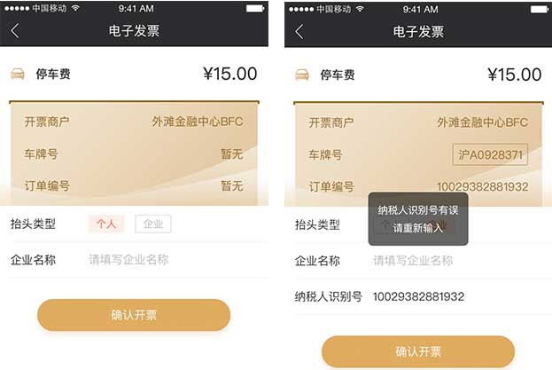
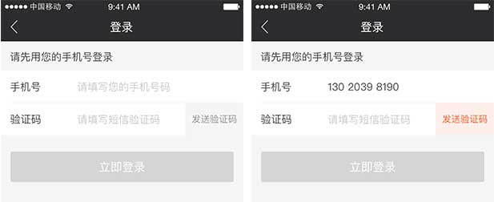

# 简单清晰 - 易懂

>作为复星集团综合性的金融服务平台，复星金服提供领先的信贷、财富、科技等一系列金融产品，让用户及其家庭可以轻松享用金融科技带来的红利，我们的产品需要做的足够简单易懂，清晰的引导，恰当的反馈，才能让更多的用户方便的使用，从获得更大的收益。

---

## 明确的目标

移动页面呈现内容需尽量保持精炼，每一个页面能够清晰的让用户明白需完成的一个任务，如右图案例，尽可能少的用户输入，唯一、明确的提交按钮。

<h2 style="display: inline;">  清晰的文案</h2>
<!-- ## 清晰的文案 -->

用精炼的浅显易懂的语言给予用户适时的说明，让用户在“扫读”的过程中能快速掌握全部信息。如右图文案提示：“对不起，您的纳税人识别号输入不正确！请重新输入，谢谢！”远没有精炼的提示“纳税人识别号有误”来的效果好。

## 恰当的反馈

每一次用户交互行为（点击，滑动，输入等）后，系统需要提供相应恰当的反馈，以确认用户的行为，同时引导用户进一步的操作：如按钮点击后的效果，输入手机号后，发送验证码按钮变成高亮，引导用户下一步点击。

