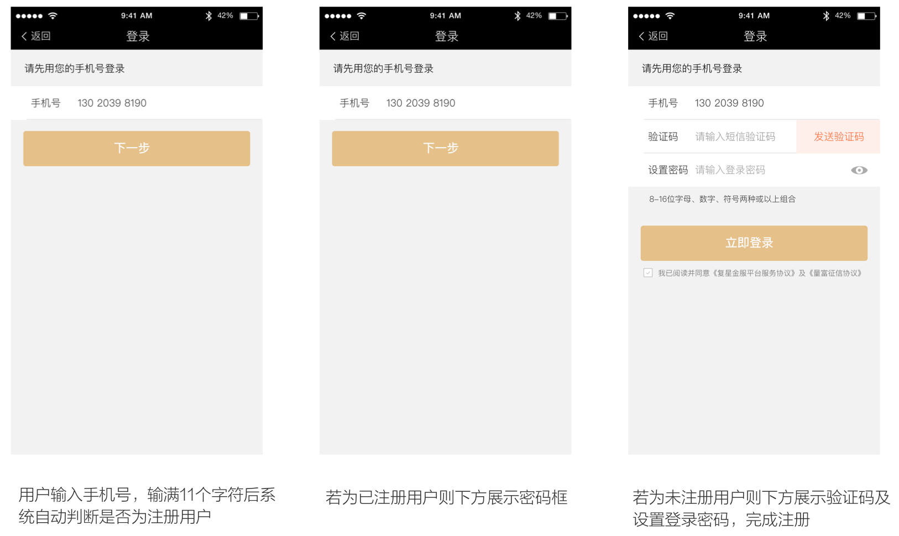

# 流程简洁 - 易用

>根据费茨法则（Fitts's Law）所描述的，如果用户鼠标移动距离越少、对象相对目标越大，那么用户越容易操作，合理的布局，配合恰当的视觉引导，同时减少用户选择，让用户可以依靠自己的过往经验快速理解如何来完成当前任务。

---

## 减少用户选择

用户在同一时间需要作出的选择和判断越多，完成任务的难度就越大，出现错误的机率也会越大。通过程序自动化的替代用户完成选择过程是非常好的一个解决方案。如下案例，无论是新用户还是老用户，无需考虑自己是要选择登录还是先完成注册，只需输入手机号，让程序来判断该手机号是否已经注册，然后自动跳转让用户继续填写登录密码或完成注册过程，这样用户只需按提示完成各项输入，就可顺利完成登录任务。

