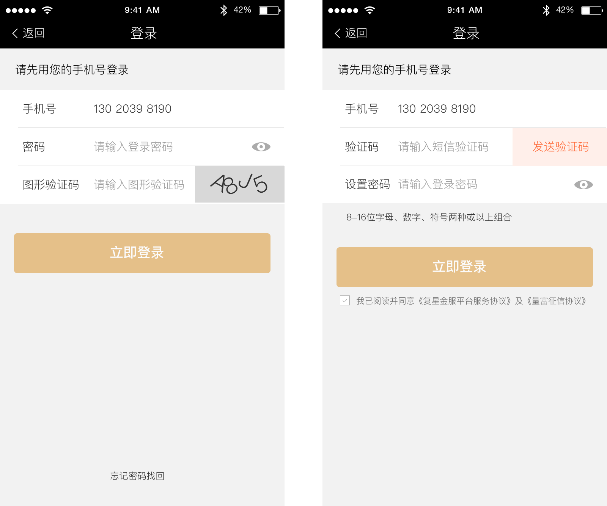

# 安全可控 - 可靠

>对于金融产品来说，用户对安全的心理需求是非常高的。在产品细节中体现安全性，专业性，可靠性是产品成功的关键之一。

---

## 品牌背书

在不影响用户使用的情况下，在产品中嵌入品牌背书的内容，在提升用户品牌认知度的同时，也增强了用户对产品的信任感。

 

## 异常防护

采用“防呆”设计，可以一定程度上降低用户出错的可能性，如输入框增加对手机，银行卡的格式化。同时增加完善的密码强度校验，多次密码输入错误需填写图形验证码等，都会在一定程度上让用户感受到产品的专业性。

